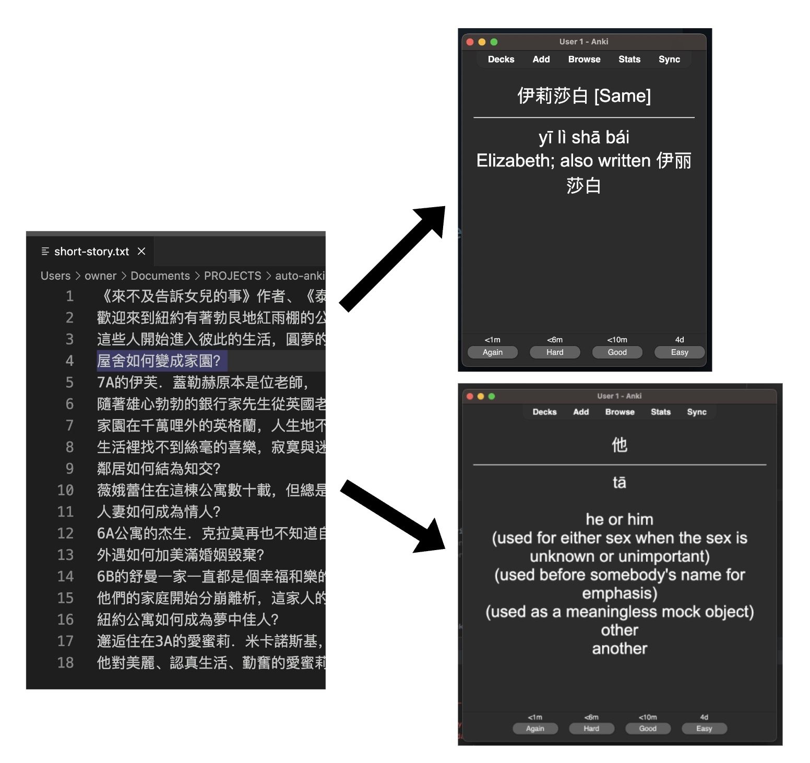
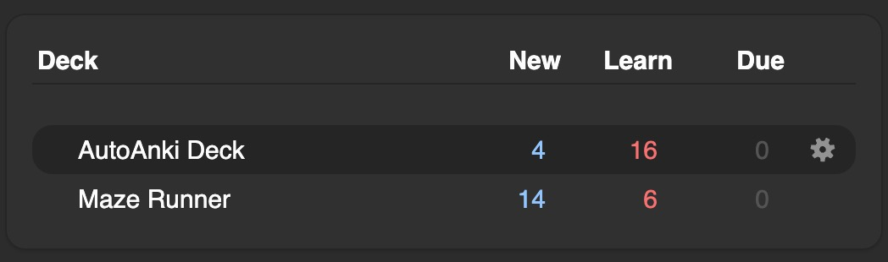
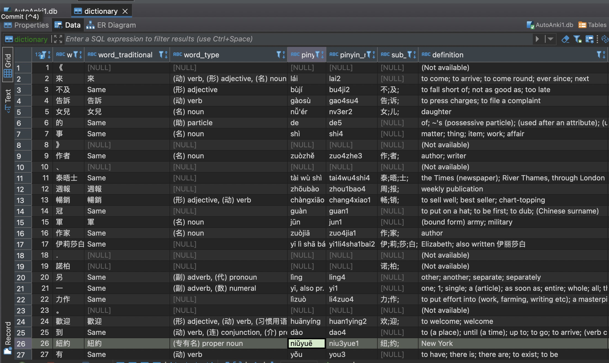
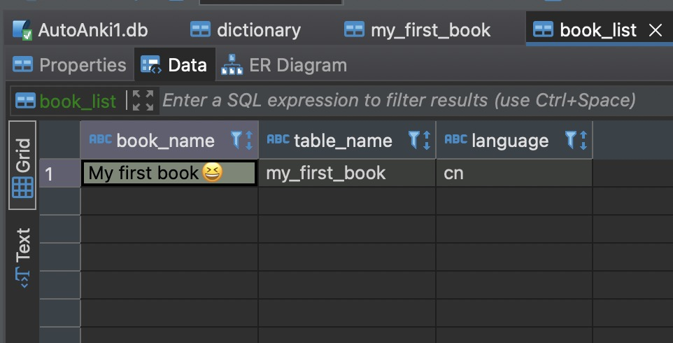
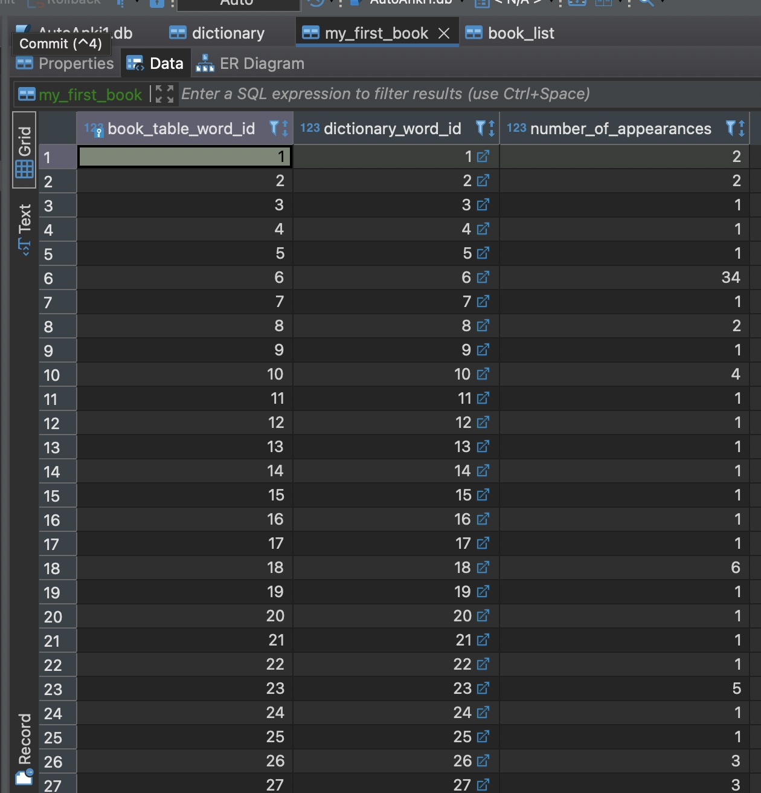

> **❗️** <br>
Pull requests welcome! If you think you can improve AA in any way, you are welcome to send me a message!

# autoanki
Auto-Generate Anki Flashcards from a text file.
 
Converts Chinese books from text files to Anki decks.



AutoAnki was created to help Chinese learners get into more advanced texts. 
It can be hard transitioning from graded readers to full books, and this tool was designed to help ease that process.

## Usage

AutoAnki is both a library and a terminal tool. 
To get started, run 
```pip install autoanki```
This should install all the requirements. Then, in a Python file do ```from autoanki import AutoAnki```

To get started, first, create a database for AutoAnki to use 
```    
db_path = "AutoAnki.db"
if not AutoAnki.is_database(db_path):
    AutoAnki.create_autoanki_db(db_path)
```
Then create an instance of AutoAnki using the database
```
aa = AutoAnki(db_path)
```
Add whatever books you want in your deck. These can be text files, or a folder full of text files
```
bookpath = 'short-story.txt'
aa.add_book(bookpath, 'My first book😆')
```
Once all of your books are added, the definitions need to be found, and then you can create a deck!
```
aa.complete_unfinished_definitions()
aa.create_deck("AutoAnki Deck", "output")
```
This will automatically have the .apkg extension, which Anki uses. Go into Anki, and import this file. You should see your deck in the list:



When getting definitions for words, it uses selenium to scrape definitions
from a dictionary website

Check your version of Chrome, and put the same version driver in the same directory as main.
Drivers can be found here ---> https://chromedriver.chromium.org/downloads

### Terminal
If you would like to run AutoAnki from the terminal, run AutoAnki/terminal.py  
This will run a terminal interface where you will be able to run

## How it works
AutoAnki interfaces has 4 components on the back end:
1. BookCleaner: Cleans the input coming in from files that the user supplies 
2. DatabaseManager: Takes the cleaned input and puts it into the database
3. Dictionary: Finds definitions for words in the database
4. DeckManager: takes information from the user and database, and makes an Anki deck 
out of it

### Database:
There are 3 different types of tables in the DB, 
1. dictionary, which holds all the definitions and other information 
2. book_list, which holds the titles of the books in the database 
3. book, based off of the name of the book, and holds the words in the book to find in the dictionary

### dictionary:
- word_id
- word
- word_traditional
- word_type (noun, verb, etc.)
- pinyin
- pinyin_numbers
- number_of_strokes
- sub_components
- frequency
- hsk_level
- top_level
- audio_path
- image_path
- definition

 
*Dictionary table*  

### book_list:
- book_name
- book_table_name
- language


*Book list table*

### book_example
 - book_table_word_id
 - dictionary_word_id
 - number_of_appearances 


*Book table*

## Planned features
- Currently, all definitions are collected from the internet. This is really slow, 
so using a dictionary from a file would greatly improve performance. It could fall back on the 
web dictionary for words it can't find
- More customization for how the cards in the deck look, and what they have on them
- The ability to hear what a word sounds like. The database supports this, I just need combine the sounds, and upload the sounds with the cards.
- There are a few TODOs in the code that I would like to fix
 
