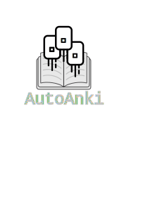

  
Tool for generating Chinese flashcards for Anki


## About

When learning Chinese, some common advice is to learn the top X most common words.
This is good advice, as you can get pretty far with this, however it's [not perfect](https://en.wikipedia.org/wiki/Zipf%27s_law#/media/File:Zipf's_law_on_War_and_Peace.png).

For example, Harry Potter. This book will have normal distribution for most words, however there will be a heavy emphasis on a specialized subset of words such as Wand, Robe, Wizard, Broomstick etc. These words will show up a lot more than they would otherwise.

The intention of this package was to allow Chinese learners to move from beginner books to more advanced material. I found there was a gap in knowledge going from beginner learning books (where there is little specalized terminology), to teen novels, where each novel will generally have its own specialized terminology, making the transition tedious. This is solved by automatically making Anki decks that have this specialized terminology, so that you are able to memorize these words while continuing to make progress

With autoanki, you selectively add words to an Anki file to continue progressing with your lanuage learning skills.

## Usage

To get started, run 
```pip install autoanki```

```python
from autoanki import AutoAnki

aa = AutoAnki()

# Add whatever books you want in your deck. These can be a single file, or a string
aa.add_book_from_string("...", 'My first book🍎')
aa.add_book_from_string('short-story.txt', 'My first book🍎')

# Once all of your books are added, the definitions need to be found, and then you can create a deck!
aa.complete_unfinished_definitions()
aa.create_deck("AutoAnki Deck", "output")
```
The `.apkg` extension will be added, which Anki uses. 
Import this file into Anki, and you're all set.


#### Other commands
Print information about the database:
```python
aa.print_database_info()
```

If you would like to create and use your own dictionary, you can pass it in:
```python
aa = AutoAnki(db_path, dictionary=CustomDictionary())
```
This dictionary must implement functions from the abstract class `autoanki/Dictionary.py`

Some settings can be set regarding how cards will be formatted, and what will be shown. They can be set here:
```python
aa.deck_settings(...)
```
| Setting                | Default  | Description                                      |
|------------------------|:--------:|:-------------------------------------------------|
| include_traditional    | True     | Include Traditional version on card              |
| include_part_of_speech | True     | Include part of speech (Noun, verb, etc.)        |
| include_audio          | False    | Include audio files and play button on each card |
| include_pinyin         | True     | Include the pinyin of a word                     |
| include_zhuyin         | False    | Include the Zhuyin of a word                     |
| hsk_filter             | None     | HSK Level. Any word with a lower level will not be added e.g. 4 will filter HSK 1-3 |
| word_frequency_filter  | None     | Frequency of word. e.g. 2000 will ignore 2000 most common words |

## Contributing

Autoanki is open to pull requests. Please open an issue on github first to discuss.
For any new feature added, please also add unit tests

If you do contribute, here are some useful commands to run before making a pull request
```bash
# List tests
pytest --collect-only

# Run linting, tests
tox
```


## Planned Features
See [ROADMAP.md](ROADMAP.md)

## Other Info

If you would like to get involved, or learn more information, reading Anki documentation is really important, especially the [Getting Started](https://docs.ankiweb.net/getting-started.html)

To get definitions, this autoanki uses the [CC-CEDICT]() under the creative commons licence. 

